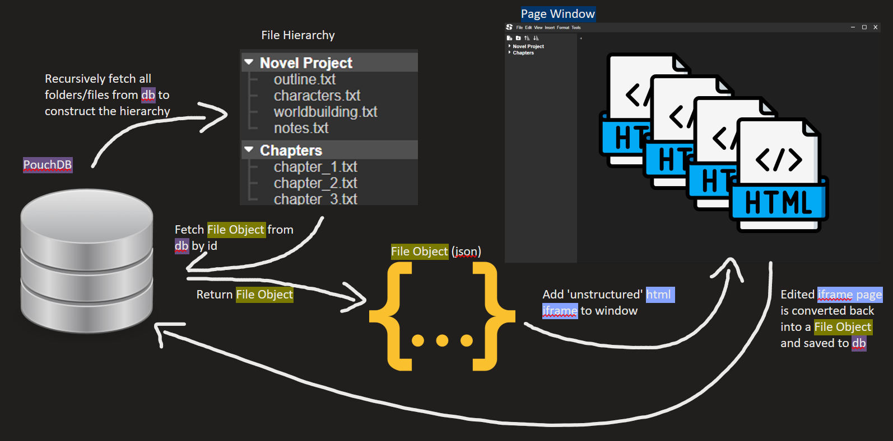
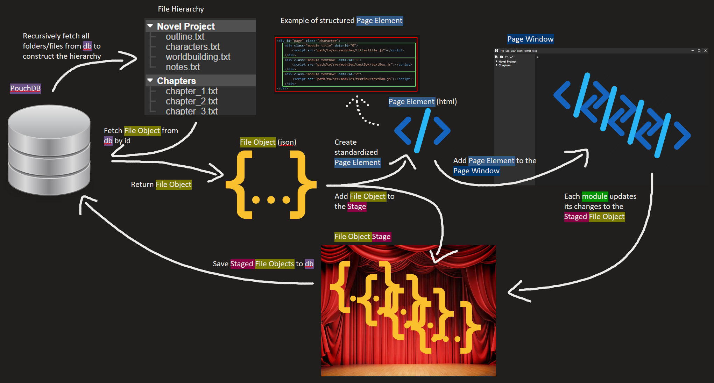

# Clabbranch (NOT ON MAIN YET)
Clabbranch is a branch of the project that currently contains the future implementation of pages. The main changes are listed below.

## Pages
Pages are no longer iframe elements inside of the pageWindow div. Instead, they are now dynamically generated inside of the pageWindow. Only one page can be 'open' at a time.
### Page Structure
The page structure has been standardized. A page is solely comprised of module divs, each of which have their own functionality and appearance that make up the page. For example, a page's html structure might look something like this:
```html
<div id="page" class="character">
    <div class="module title" data-id="0">
        <script src="path/to/src/modules/title/title.js"></script>
    </div>
    <div class="module textBox" data-id="1">
        <script src="path/to/src/modules/textBox/textBox.js"></script>
    </div>
    <div class="module textBox" data-id="2">
        <script src="path/to/src/modules/textBox/textBox.js"></script>
    </div>
</div>
```
Notice: This is what a page looks like immediately after being constructed - before the scripts can be executed and construct their respective modules. However, whataver they do is stays within their own div (at least they should) so this structure remains the same.

## Tabs
Tabs have been reduced to "shortcuts" to a specific page. Their html elements contain a pageId in their dataset that they use to fetch and display their cooresponding page. 

## Staged Page
The 'Staged Page' is an instance of a file object from the database that is directly manipulated. Instead of reading and writing to and from the database for every change, the Staged Page object is used instead. This allows us to have the ability to disregard and throw away the changes made to the Staged Page or write the modified Staged Page back to the database. 

# Dataflow
## Opening a page
When the user clicks on a file in the file hierarchy, the following occures:
1. Fetched the page from the database. 
2. Pass the file object to `constructPage()`.
3. Look for any tabs already open for that page (tab's pageId dataset == file object's id). If none exist, create a new tab with `createTab()`.


## Constructing a page (`src/components/hierarchy/pageConstructor.js/constructPage()`)
1. Clear the innerHTML of the pageWindow div
2. Create a new page div to be the child of the pageWindow
3. For each module in the file object:
    1. Create a new module div with an id of its module index to be a child of the page div.
    2. Attach a script element with its src being determined by the module's type.
        1. As the div with the script is loaded, it can access the Staged Page object, access its module based on its id (index), and do whatever the module needs for its functionality.

## Creating a tab (`src/components/hierarchy/tabManager.js/createTab()`)
1. Create a new div in the tab header div. Set its pageId dataset to the file object's id.
2. Create the close button within the tab div and add a click event listener to it which:
    1. Stops the click from propagating to the tab's click event
    2. If the tab doesn't belong to the currently Staged Page, remove it. Else, if it does, then:
        1. (WIP) Save or discard the Staged Page to the database based on the user's settings.
        2. Get the index of the closing tab.
        3. Remove the tab's div from the tab header div.
        4. If there are no more tabs in the tab header div, the pageWindow div's innerHTML is cleared. Else, if there are still tabs in the tab header div:
            1. The tab with the same index of the newly removed tab becomes the tab to be opened. If the index is larger than the number of tabs in the tab header div, then the last tab is is to be opened instead.
            2. The pageId of the tab to be opened is gotten from its dataset and the file object is fetched from the database.
            3. Pass the file object to `constructPage()`.
3. Add a click event listener to the tab div which:
    1. Get the pageId from the tab div's dataset and fetch the file object from the database.
    2. Pass the file object to `constructPage()`.

# Current page handling:


# Updated page handling:
